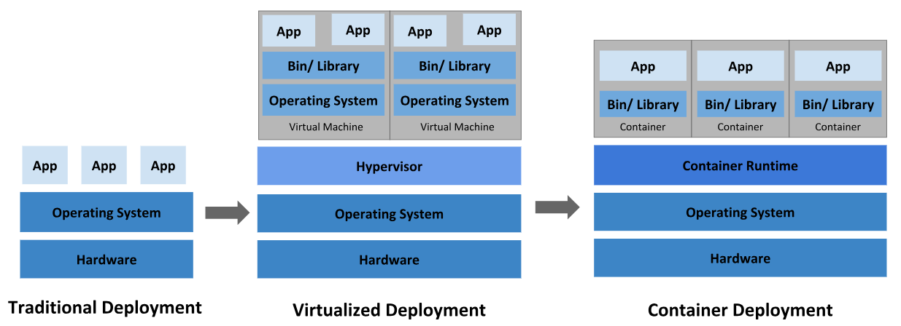
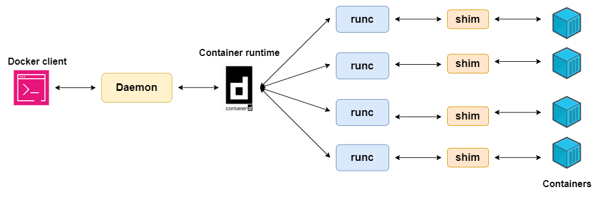

**Contents**

- [What is Containerization?](#what-is-containerization)
- [Containerization Architecture](#containerization-architecture)
- [Compare Virtualization and Containerization](#compare-virtualization-and-containerization)
- [How Containerization work?](#how-containerization-works)
- [Key Benefits of Containerization](#key-benefits-of-containerization)
- [Containerization platforms and tools](#containerization-platforms-and-tools)

### What is Containerization?

- *Containerization* is a software deployment process that bundles an application’s code with all the files and libraries it needs to run on any infrastructure.

Traditionally, to run any application on your machine, you have to install the version that matched your machine's operating system. For example, you using a Window and want to install MySQL Server, you need to dowload the Window version of MySQL Server to run it. 

However, with containerization, you can create a single software package, or [container](), that runs on all types of devices and operating systems. 

You can see more about [containerization history](https://www.techtarget.com/searchitoperations/feature/Dive-into-the-decades-long-history-of-container-technology).

### Containerization Architecture

Container images are the top layer in a containerized system that consists of the following layers:

1. Infrastructure: hardware layer of the container model. 

2. Operating System: second layer of containerization architecture (Linux is a popular one).

3. Container Engine: is a software program that creates containers based on the container images. It acts as an intermediary agent between the containers and the OS.

4. Application and dependencies: topmost layer contains application code and files it needs to run, such as dependencies and related configuration files. This layer also can contains a light guest OS installed over the host OS.

### Compare Virtualization and Containerization

  

The picture above describes differents from three types of application deployments.

Some important differences between Virtualization and Containerization are: 
- *Architecture and Isolation*
- *Resource Utilization and Efficency*
- *Performance*
- *Portability and Deployment*
- *Management and Orchestration*
- *Use cases and Security*...

### How Containerization works?

  

[References](https://www.dclessons.com/how-docker-engine-works)

### Key Benefits of Containerization

- `Portability`: S/W developers use containerization to deploy applications in multiple environments without rewriting the program code.

- `Isolation, Fault tolerance and Security`: Each container runs in its own isolated environment. Containers provide a layer of isolation between the application and the host system. Because of that, the failure of one container does not affect the continued operation of any other containers. By this, you can also minimize the potential damage.

- `Resource efficiency`: Containers allow you to run mulitple isolated applications on the same host system because they share the same OS kernel. This advantage is particularly beneficial in cloud environments, where charges are often based on your resource usage.

- `Scalability`: In the past, if you want to scale the appication, you have to manually create new servers or other resources and config them. But with containerization, you can use a container orchestration ([Kubernetes]() or [Docker Swarm](), for example) to shorten software scale process.

### Containerization platforms and tools

Nowadays, there's a lots of containerization platforms and tools available. Some of the most popular ones include Docker, Kubernetes, OpenShift...

In this section, i will only talk about the most common one, [Docker](https://www.docker.com/).

`Docker is an open platform for developing, shipping and running applications.` It provides the ability to package and run an application in a loosely isolated environment called a container.

- **Solomon Hykes** walked onto the stage at PyCon **2013** and revealed Docker to the world for the first time

Docker uses a `client-server architecture`. The Docker client talks to the Docker daemon, which does the heavy lifting of building, running, and distributing your Docker containers.

  

- `Docker Engine`: is a *technology* that helps you to build and containerize your application. It contains some components below:

   - Docker Daemon (**dockerd**): *its a process*, core of the container engine, the daemon runs on the host machine and oversees container operations. It listens for API request from the client and performs actions such as creating, running and stopping containers.

   - Docker Client (**client**): *is the command line interface (CLI)* tool that's used to send these commands to **dockerd**, which carries them out. The **docker** command uses the Docker API.

   - Container Runtime (**runc** for Docker): *is a software*. It's the fundamental component responsible for actually running the containers, it creates and manages container processes by interfacing with the OS. In case you want to know more about [container runtime](https://www.wiz.io/academy/container-runtimes).

- `Docker Registry`: a places to store Docker images. Dockerhub is a public registry that anyone can use. Dockerhub is the default docker registry when you use `docker` command (`docker pull` for example) if you don't config specified registry.

- `Docker objects`: When you use Docker, you are creating and using images, containers, networks, volumes, plugins and other objects. 

### **References**:

- [Amazon Web Services: What is containerization](https://aws.amazon.com/what-is/containerization/)

- [Kodekloud: Docker Containrization - Key Benefits and Use cases](https://kodekloud.com/blog/docker-containerization/)

- [IBM: Containerization](https://www.ibm.com/topics/containerization)

- [GeeksforGeeks: Containerization Architecture in System Design](https://www.geeksforgeeks.org/containerization-architecture-in-system-design/)

- [DCLessions: How Docker Engine Works](https://www.dclessons.com/how-docker-engine-works)

- [TechTarget: The evolution of containers - Docker, Kubernetes and the future](https://www.techtarget.com/searchitoperations/feature/Dive-into-the-decades-long-history-of-container-technology)

### **Questions**:

- [What is Container Engine?]()

- [What is Hypervisor?]() Is a type of computer software, firmware or hardware that creates and runs virtual machines. (Example, Hypervisor for Window and Kernel-base Virtual Machine for Linux).