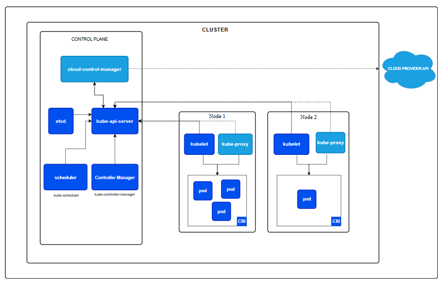

# Container Orchestration and Kubernetes Overview

**Contents**

[Container Orchestration](#container-orchestration)

- [What is container orchestration?](#what-is-container-orchestration)

- [Container orchestration tools](#container-orchestration-tools)

[Kubernetes Overview](#kubernetes-overview)

- [What is Kubernetes?](#what-is-kubernetes)

- [Kubernetes architecture components](#kubernetes-architecture-components)

- [Kubernetes Workloads](#kubernetes-workloads)

### Container Orchestration

#### What is Container Orchestration?

*Container orchestration* is the process of automating the deployment, management, scaling, and networking of containers.

Container orchestration uses [declarative programming](https://en.wikipedia.org/wiki/Declarative_programming), which means you define the desired output instead of describing the steps needed to make it happen. Developers write a configuration file that describe the config of containers and other resources. Container orchestration tools use this file to achieve the requested end state automatically.

Container orchestration can be used in any computing environment that supports containers like on-premise, public, private or cloud computing.

#### Benefit of Container Orchestration

`One of the biggest benefits of container orchestration is that it simplifies operations.` With persional experiments, 2 biggest benefits of container orchestration is `scale` and `update` your application (rolling update).

We can see some advantages of container orchestration like:

- Reliable application development: CO increases deployment velocity and makes them ideal for supporting agile development approachs like DevOps.

- Scalability: CO allows you to scale your container deployments up or down based in your changing workload.

- High availability: Its easier to detect and fix infrastructure failures using CO tools. If a container fails, CO tools can restart or replace it automatically, leads to maintain avaiability and increasing application uptime.

- Better productivity: CO tools help to reduce repetitive task and remove the burden of installing, managing and maintaining containers.

- Enhanced security: Container orchestration allows you to manage security policies across platforms and helps reduce human errors that can lead to vulnerabilities...

- Lower cost: Containers require fewer resource than virtual machines, leads to cost reduction and better performance. In addition, container orchestration require less human capital and time, yielding additional cost savings.

#### Container Orchestration tools

Tasks perform using container orchestration tools include:

- Allocating resources among containers

- Scaling containers up and down based on workload

- Routing traffic and balancing loads

- Assigning services and applications to specific containers

- Deployment and Provisioning

There are a lot of container orchestration tools active now with different advantages:

- [Kubernetes (developed by Google, now maintained by CNCF)]()

- [Openshift (Red Hat)]()

- [Docker Swarm (Docker)]()

- ...

In this note, I will talk about **Kubernetes**.

### Kubernetes Overview

#### What is Kubernetes?

`Kubernetes is a portable, extensible, open source platform for managing containerized workloads and services, that facilitates both declarative configuration and automation.` - [Kubernetes Document](https://kubernetes.io/docs/concepts/overview/)

- **Created in 2014** (first commit of Kubernetes was pushed to Github on June 6th 2014), by **Google**, now managed by **Cloud Native Computing Foundation**

- **Version 1.0 was released on July 21, 2015**

- Written by **Golang** (not C++ like `Borg`, Google's internal cluster management system, what Kubernetes based on)

#### Kubernetes Architecture Components

  

A Kubernetes cluster consists of control plane(s) and one or more worker nodes. Here's a overview of the main components:

- `Control Plane components`:

   - **kubeapi-server**: The core component server that exposes the Kubernetes HTTP API

   - **etcd**: Consistent and high-ly avaiable key value store for all API server data

   - **kube-scheduler**: Looks for Pods not yet bound to a node, and assigns each Pod to a suitable node

   - **kube-controller-manager**: Run controllers to implement Kubernetes API behavior

   - cloud-controller-manager: Intergrates with underlying cloud provider(s)

- `Node components`:

   - **kubelet**: Ensures that Pods are running, including their containers

   - **kube-proxy**: Maintains network rules on nodes to implement Services

   - **container runtime**: Software responsible for running containers

#### Kubernetes Workloads

You know that your applications run as containers inside Pods. How ever, managing individual Pods would be a lot of effort. For example, if a Pod fails, you probably want to run a new Pod to replace it. Kubernetes can do it for you.

You can use the Kubernetes API to create a workload object that represents a higher abstraction level than a Pod.

There are built-in APIs for managing workloads are:

- [Pod]()

- [Deployment]()

- [StatefulSet]()

- [DaemonSet]()

- [Job / CronJob]()

#### References

- [Kubernetes Documents](https://kubernetes.io/docs/home/)

- [Google Cloud: What is container orchestration?](https://cloud.google.com/discover/what-is-container-orchestration)

- [GCore: Top 10 Container Orchestration tools](https://gcore.com/blog/top-10-container-orchestration-tools/)