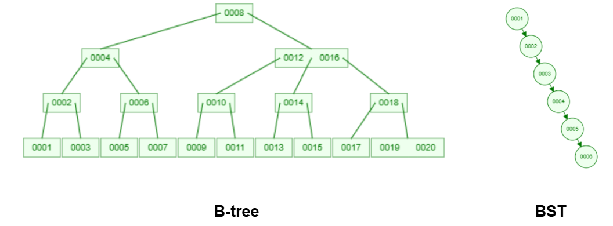

# [Database Overview - Final Version]()

## [**Contents**](#contents)

- [**Database Overview**](#database-overview)
  - [What is database?](#what-is-database)
  - [Database types: Relational and Non-relational database](#database-types-relational-and-non-relational-database)
  - [(Relational) Database concepts: table, column, row, schema, index, keys, constraints..](#relational-database-concepts-table-column-row-schema-index-keys-constraints-query)

- [**Target and plan (MySQL)**](#target-and-plan)
  - [Install and configure MySQL server](#install-and-configure-mysql-server)
  - [Manage user, permissions](#manage-user-permissions)
  - [Data type, variable](#data-type-variable)
  - [Important Parameters](#important-parameters)

- [**References**](#references)

## [**Database Overview**]()
- [What is database?](#what-is-database)
- [Database types: Relational and Non-relational database](#database-types-relational-and-non-relational-database)
- [(Relational) Database concepts: table, column, row, schema, index, keys, constraints..](#relational-database-concepts-table-column-row-schema-index-keys-constraints-query)

### [What is database?]()

**So, what is a database?** 
- A database is a collection of data that represents some aspect of the real world, having a unified logical relationship, designed and containing data that serves some purposes.

- For example, a university will have a database to store information about students, teachers, courses, score... . A bank will have a database to store information about customers, accounts, transactions...

### [Database types: Relational and Non-relational database]()

Database can be classified into 2 primary types: `Relational` and `NoSQL` databases.

NoSQL databases include several different models for accessing and managing data, each suited to specific use cases. 

  

  

### [(Relational) Database concepts: table, column, row, schema, index, keys, constraints..]()

#### Table - Column - Row

  

#### Schema

A database schema is a logical representation of data that shows how the data in a database should be stored logically. It shows how the data is organized and the relationship between the tables.

#### Index

**Indexes** are used to find row with specific columns values quickly. Without an index, MySQL must begin with the first row and then read through the entire table to find the relevant rows. The larger table, the more cost it takes. If the table has an index for the columns in question, MySQL can quickly determine the position to seek to in the middle of the data file without having to look at all the data. This is much faster than reading every row sequentially.

Most SQL indexes are stored in [B-tree](). 

**B-tree indexing:**

The **B-tree**, also called balanced-tree, its nodes are sorted in a inorder traversal. A node in a B-tree can have more than 2 children. The height of a b-tree adjusts automatically, b-tree has lowest value on the left and the highest value on the right.

Different points from b-tree over binary tree:

  

  - A B-tree node can have more than 2 childs (based on B-tree order)

  - A B-tree node can have more than one value (not like in binary tree, has one value only)

#### Key

In a relational database, a **Key** is defined as a column or a group of columns which are used to uniquely locate records in a table.

There are some common keys in MySQL:

  - **Primary key**: Used to identify one and only one record of a table uniquely. A table can have only one primary key. Primary key must contain UNIQUE value and it can't be NULL. The Primary key can contain a single or multiple columns.

  - **Foreign key**: Is a column (or collection of columns) in one table, that refers to the primary key in another table.

  - **Unique key**: A group of one or more columns of a table that uniquely identify a record is known as a unique key. It prevents from storing duplicate value in two records in a column. Unique key can have NULL value.

  - **Candicate key**: Keys that can uniquely identify the record so except primary key, remaining key are considered as candicate key.

  - **Super key**: A super key is a set of one or more attributes that, taken collectively, can uniquely identify a record in a table.

#### Constraints

**SQL constraints** are used to specify rules for the data in a table.

Constraints are used to limit the type of data that can go into a table. This ensures the accuracy and reliability of the data in the table. If there is any violation between the constraint and the data action, the action is aborted.

Common constraints in SQL database:

  - **NOT NULL**: Ensures that a column can't have a NULL value

  - **UNIQUE**: Ensures that all values in a column are different

  - **PRIMARY KEY**: Combination of NOT NULL and UNIQUE, used to identifies each row in a table

  - **DEFAULT**: Provides a default value for a column when no value is specified during an insert operation

## [**References**]()

List of references:

  - [Master. Phuong Nguyen Hong]() - Database Course (SOICT - Hanoi University of Science and Technology)

  - [dev.mysql.com](https://dev.mysql.com/doc/refman/8.4/en/server-system-variables.html) - Server System Variables

  - [mongodb.com](https://www.mongodb.com/resources/compare/relational-vs-non-relational-databases) - Relational vs Non.Relational Databases

  - [learn.microsoft.com](https://learn.microsoft.com/en-us/dotnet/architecture/cloud-native/relational-vs-nosql-data) - SQL vs. NoSQL data