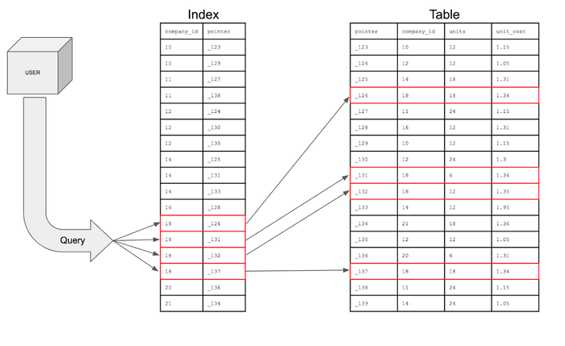
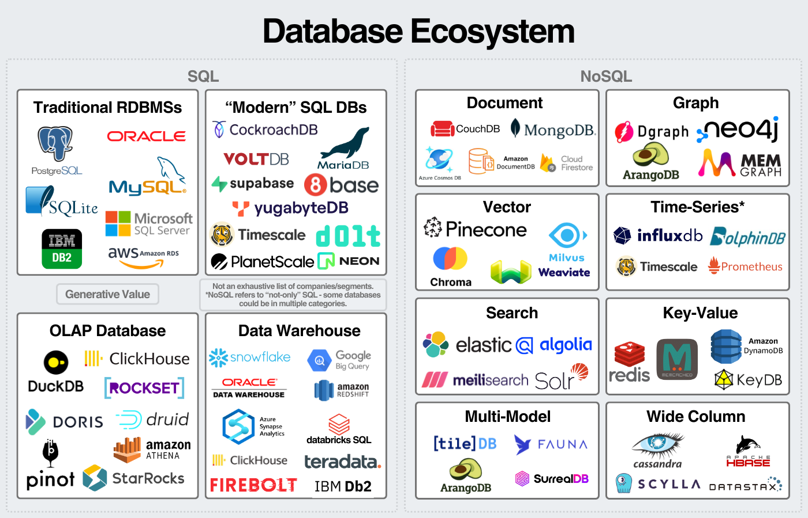

# Contents

- [Data Overview](#data-overview)

  - [Database concepts: database, table, column/field, row/record,. schema, index, keys, constrains, query..](#database-concepts)

  - [Database types: relational database, non-relational database..](#database-types)

  - [Database management: update, backup, store](#database-management)

- [Target and plan](#target-and-plan)

  - [Install and configure MySQL server](#install-and-configure-mysql-server)

  - [Management user, permissions](#management-user-permissions)

  - [Basic Query](#basic-query)

  - [Datatype, Variables](#datatype-variables)

  - [List important parameter](#list-important-parameter)

## Data overview

### Database concepts

**What is database?**

-  The most efficent way to store data is with the help of a database. A database is an organized collection of structured information, or data, typically stored electronically in a computer system.

**What is tables in Relational Database?**

- Tables are database objects that contain all the data in a database. In tables, data is logically organized in a row-and-column format similar to a spreadsheet. Each row represents a record, and each column represents a field in the record.

<div style="text-align: center;">
  
</div>

**What is index in database?**

- An index is a database structure that you can use to improve the performance of database activity. Each index will contain sorted value of indexed column and pointer to its row. (**B-Tree Indexing**)

<div style="text-align: center;">
  
</div>

**What is key in database?**

- A key is an attribute or set of attributes that identifies records in a table. 

  - Primary
  - Foreign
  - Unique

<div style="text-align: center;">
  
</div>

**Constraints**

- SQL constraints are used to specify rules for the data in a table. They are used to limit the type of data that can go into a table. 

Common constraints:

- NOT NULL
- UNIQUE
- PRIMARY KEY (NOT NULL + UNIQUE)
- FOREIGN KEY

**What is database schema?**

- A database schema refers to the logical and visual configuration of the entire relational database. 

### Database types

Databases can be classified into two primary types: `Relational` and `NoSQL Databases`.

Relational database: stores information in tables. Example: MySQL, SQL Server, Oracle, PostgreSQL...

NoSQL databases is then further divided into many types:

<div style="text-align: center;">
  
</div>

### Database management

## Target and plan

### Install and configure MySQL server

**Task: Install MySQL server: 5.7**

Dowload MySQL Repository

```console
$ wget https://dev.mysql.com/get/mysql-apt-config_0.8.12-1_all.deb
$ ls
mysql-apt-config_0.8.12-1_all.deb
```

After MySQL package dowloaded success, install it:

```console
$ sudo dpkg -i mysql-apt-config_0.8.12-1_all.deb
```

Then choose options follow steps `Ubuntu Bionic` - `MySQL Server & Cluster option` - `mysql-5.7` - `OK`.

Update the repository:

```console
$ sudo apt update
```

Import key:

```console
$ sudo apt-key adv --keyserver hkp://keyserver.ubuntu.com:80 --recv-keys [add_key_here]
```

Update one more time:

```console
$ sudo apt update --allow-insecure-repositories
$ sudo apt update
```

Check if MySQL 5.7 version repository successfully installed:

```console
$ sudo apt-cache policy mysql-server
mysql-server:
  Installed: (none)
  Candidate: 8.0.39-0ubuntu0.22.04.1
  Version table:
    ...       
    5.7.42-1ubuntu18.04 500
      500 http://repo.mysql.com/apt/ubuntu bionic/mysql-5.7 amd64 Packages
```

Install MySQL 5.7 version:

```console
$ sudo apt install -f mysql-client=5.7* mysql-community-server=5.7* mysql-server=5.7*
```

Check MySQL Server version

```console
$ mysql --version
mysql  Ver 14.14 Distrib 5.7.42, for Linux (x86_64) using  EditLine wrapper
```

**Task: Change configuration option**

Change port MySQL to 9306 and bind-address to private IP: Edit in config file `/etc/mysql/mysql.conf.d/mysqld.cnf`

Stop MySQL:

```console
$ sudo systemctl stop mysql
```

Add lines `port = 9306` and `bind-address    = 192.168.56.6 (your private IP address)`

Start MySQL again and check:

```sql
mysql> SHOW GLOBAL VARIABLES LIKE 'PORT';
+---------------+-------+
| Variable_name | Value |
+---------------+-------+
| port          | 9306  |
+---------------+-------+
1 row in set (0.00 sec)
```

**Change log path to /home/database/mysql/logs**

Stop MySQL service:

```console
$ sudo systemctl stop mysql
```

Create a new directory to store log:

```console
$ sudo mkdir -p /home/database/mysql/logs
$ sudo chmod 777 /home/database/mysql
```

Copy logs from default location to new location and remove old one:

```console
$ sudo rsync -avz /var/log/mysql/error.log /home/database/mysql/logs
$ sudo mv /var/log/mysql /var/log/mysql-old
```

Change log file location in config file `/etc/mysql/mysql.conf.d/mysqld.cnf`:

```
log-error = /home/database/mysql/logs/error.log
```

Fix apparmor reflect directory change:

```console
$ sudo nano /etc/apparmor.d/tunables/alias
# Add line: alias /var/log/mysql -> /home/database/mysql/logs,
$ sudo apparmor_parser -r /etc/apparmor.d/usr.sbin.mysqld   
```

Start MySQL Server again and check:

```
$ sudo systemctl start mysql
$ cat /home/database/mysql/logs/error.log
```

You can see the content of new log and old log located in new directory successfully!

**max_connections: 100**

Edit in config file `/etc/mysql/mysql.conf.d/mysqld.cnf`:

Stop MySQL, add line `max_connections = 100`, start and check:

```sql
mysql> SHOW VARIABLEs LIKE 'max_connections';
+-----------------+-------+
| Variable_name   | Value |
+-----------------+-------+
| max_connections | 100   |
+-----------------+-------+
1 row in set (0.00 sec)
```

Beside `max_connections`, there are more some parameters MySQL help us to control the number of connections to out database:

  - **max_user_connections**: limit connections per user to prevent a user create too much connections to database.

  - **wait_timeout (non-interactive), interactive timeout**: limit to time a connection doesn't made interact to database before logout. 

  - **max_connect_errors**: Limit of error connect from a host before block it.

  - **back_log**: -1 (autosize) or equal to max_connections.

### Management user, permissions

**Task: Create user admin, client with permissions**

```sql
mysql> CREATE USER 'admin'@'localhost' IDENTIFIED BY 'Admin@1';
mysql> GRANT SELECT, INSERT, DELETE, UPDATE on *.* TO 'admin'@'localhost' WITH GRANT OPTION;
mysql> CREATE USER 'client'@'localhost' IDENTIFIED BY 'Client@1';
mysql> GRANT SELECT on *.* TO 'client'@'localhost' WITH GRANT OPTION;
mysql> FLUSH PRIVILEGES;
```

**Task: Access to database using user client and admin**

```console
$ mysql -u admin -p
Enter password: 
Welcome to the MySQL monitor.  Commands end with ; or \g.
Your MySQL connection id is 3
```

### Basic Query

**Self practice: create, delete database - create, drop, truncate, alter table**

**Self practice: insert, update, delete records/row**

### Datatype, Variables

### List important parameter

## References

- [devart.com - How to install MySQL in ubuntu](https://www.devart.com/dbforge/mysql/how-to-install-mysql-on-ubuntu/#install-mysql-5-on-ubuntu)
- [learn.microfost.com - Tables](https://learn.microsoft.com/en-us/sql/relational-databases/tables/tables?view=sql-server-ver16)
- [progress.com - How to implement and use database indexes](https://www.progress.com/tutorials/odbc/using-indexes)
- [Oracle.com - What is database](https://www.oracle.com/vn/database/what-is-database/)
- [w3schools.com - MySQL Constraints](https://www.w3schools.com/mysql/mysql_constraints.asp)