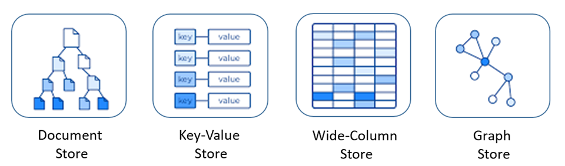

# [Database Overview - Final Version]()

## [**Contents**](#contents)

- [**Database Overview**](#database-overview)
  - [History of database](#history-of-databse)
  - [What is database?](#what-is-database)
  - [Database types: Relational and Non-relational database](#database-types-relational-and-non-relational-database)
  - [(Relational) Database concepts: table, column, row, schema, index, keys, constraints..](#relational-database-concepts-table-column-row-schema-index-keys-constraints-query)

- [**Target and plan (MySQL)**](#target-and-plan)
  - [Install and configure MySQL server](#install-and-configure-mysql-server)
  - [Manage user, permissions](#manage-user-permissions)
  - [Basic Query](#basic-query)
  - [Data type, variable](#data-type-variable)
  - [Important Parameters](#important-parameters)

- [**References**](#references)

## [**Database Overview**]()
- [History of database](#history-of-databse)
- [What is database?](#what-is-database)
- [Database types: Relational and Non-relational database](#database-types-relational-and-non-relational-database)
- [(Relational) Database concepts: table, column, row, schema, index, keys, constraints..](#relational-database-concepts-table-column-row-schema-index-keys-constraints-query)

### [History of databse]()


### [What is database?]()

**So, what is a database?** 
- A database is a collection of data that represents some aspect of the real world, having a unified logical relationship, designed and containing data that serves some purposes.

- For example, a university will have a database to store information about students, teachers, courses, score... . A bank will have a database to store information about customers, accounts, transactions...

### [Database types: Relational and Non-relational database]()

Database can be classified into 2 primary types: `Relational` and `NoSQL` databases.

NoSQL databases include several different models for accessing and managing data, each suited to specific use cases. 

<div style="text-align: center;">
  
</div>

<div style="text-align: center;">
  
</div>

### [(Relational) Database concepts: table, column, row, schema, index, keys, constraints..]()

#### Table - Column - Row

<div style="text-align: center;">
  
</div>

#### Schema

#### Index

#### Key

#### Constraints

SQL constraints are used to specify rules for the data in a table.

Constraints are used to limit the type of data that can go into a table. This ensures the accuracy and reliability of the data in the table. If there is any violation between the constraint and the data action, the action is aborted.

Common constraints in SQL database:

  - **NOT NULL**: Ensures that a column can't have a NULL value

  - **UNIQUE**: Ensures that all values in a column are different

  - **PRIMARY KEY**: Combination of NOT NULL and UNIQUE, used to identifies each row in a table

  - **DEFAULT**: Provides a default value for a column when no value is specified during an insert operation

## [**Target and Plan (MySQL)**]()

- [Install and configure MySQL server](#install-and-configure-mysql-server)
- [Manage user, permissions](#manage-user-permissions)
- [Data type, variable](#data-type-variable)
- [Important Parameters](#important-parameters)

### [Install and configure MySQL server]()

`Task`: **Install MySQL server: version 5.7, change configuration option:**

  - **Install MySQL Server 5.7**

Dowload MySQL Repository
 
```console
$ wget https://dev.mysql.com/get/mysql-apt-config_0.8.12-1_all.deb
$ ls
mysql-apt-config_0.8.12-1_all.deb
```
 
After MySQL package dowloaded success, install it:
 
```console
$ sudo dpkg -i mysql-apt-config_0.8.12-1_all.deb
```
 
Then choose options follow steps `Ubuntu Bionic` - `MySQL Server & Cluster option` - `mysql-5.7` - `OK`.
 
Update the repository:
 
```console
$ sudo apt update
```
 
Import key:
 
```console
$ sudo apt-key adv --keyserver hkp://keyserver.ubuntu.com:80 --recv-keys [add_key_here]
```
 
Update one more time:
 
```console
$ sudo apt update --allow-insecure-repositories
$ sudo apt update
```
 
Check if MySQL 5.7 version repository successfully installed:
 
```console
$ sudo apt-cache policy mysql-server
mysql-server:
  Installed: (none)
  Candidate: 8.0.39-0ubuntu0.22.04.1
  Version table:
    ...       
    5.7.42-1ubuntu18.04 500
      500 http://repo.mysql.com/apt/ubuntu bionic/mysql-5.7 amd64 Packages
```
 
Install MySQL 5.7 version:
 
```console
$ sudo apt install -f mysql-client=5.7* mysql-community-server=5.7* mysql-server=5.7*
```
 
Check MySQL Server version
 
```console
$ mysql --version
mysql  Ver 14.14 Distrib 5.7.42, for Linux (x86_64) using  EditLine wrapper
```

  - **port 9306**: Add line **port = 9306** to `/etc/mysql/mysql.conf.d/mysqld.cnf` file
```sql
mysql> SHOW GLOBAL VARIABLES LIKE 'port';
+---------------+-------+
| Variable_name | Value |
+---------------+-------+
| port          | 9306  |
+---------------+-------+
1 row in set (0.00 sec)
```


  - **bind-address: private ip address**
  - **change log path: /home/database/mysql/logs**

Stop MySQL service:

```console
$ sudo systemctl stop mysql
```

Create a new directory to store log:

```console
$ sudo mkdir -p /home/database/mysql/logs
$ sudo chmod 777 /home/database/mysql/logs
```

Copy logs from default location to new location and remove old one:

```console
$ sudo rsync -avz /var/log/mysql/error.log /home/database/mysql/logs
$ sudo mv /var/log/mysql /var/log/mysql-old
```

Change log file location in config file `/etc/mysql/mysql.conf.d/mysqld.cnf`:

```
log-error = /home/database/mysql/logs/error.log
```

Fix apparmor reflect directory change:

```console
$ sudo nano /etc/apparmor.d/tunables/alias
# Add line: alias /var/log/mysql -> /home/database/mysql/logs,
$ sudo apparmor_parser -r /etc/apparmor.d/usr.sbin.mysqld   
```

Start MySQL Server again and check:

```
$ sudo systemctl start mysql
$ cat /home/database/mysql/logs/error.log
```

You can see the content of new log and old log located in new directory successfully!

  - **max connections = 100**: Add line **max_connections = 100** to `/etc/mysql/mysql.conf.d/mysqld.cnf` file

```sql
mysql> SHOW GLOBAL VARIABLES LIKE 'max_connections';
+-----------------+-------+
| Variable_name   | Value |
+-----------------+-------+
| max_connections | 100   |
+-----------------+-------+
1 row in set (0.00 sec)
```

  - **log level (error, warning, info), log type (error, slow), check log (slow, general, error)**
  - **password policy**
### [Manage user, permissions]()
`Task`:
  - **Create user: admin, client**

  ```sql
mysql> CREATE USER 'admin'@'localhost' IDENTIFIED BY 'Admin@1';
mysql> GRANT SELECT, INSERT, DELETE, UPDATE on *.* TO 'admin'@'localhost' WITH GRANT OPTION;
mysql> CREATE USER 'client'@'localhost' IDENTIFIED BY 'Client@1';
mysql> GRANT SELECT on *.* TO 'client'@'localhost' WITH GRANT OPTION;
mysql> FLUSH PRIVILEGES;
```
```
mysql> SELECT USER, HOST FROM mysql.user;
+------------------+--------------+
| USER             | HOST         |
+------------------+--------------+
| admin            | localhost    |
| client           | localhost    |
| root             | localhost    |
+------------------+--------------+
8 rows in set (0.00 sec)
```
  - **Access to database via user admin, client**

Login to MySQL server:

```console
$ mysql -u admin -p
Enter password:
```
```
Welcome to the MySQL monitor.  Commands end with ; or \g.
Your MySQL connection id is 9
Server version: 8.0.39-0ubuntu0.22.04.1 (Ubuntu)
...
mysql>
```

### [Data type, variable]()

### [Important Parameters]()

- **max_connections**: 

- **max_user_connections**: 

- **max_connect_errors**:

- **wait_timeout**:

- **interactive_timeout**:

## [**References**]()

List of references:

  - [Master. Phuong Nguyen Hong]() - Database Course (SOICT - Hanoi University of Science and Technology)

  - [dev.mysql.com](https://dev.mysql.com/doc/refman/8.4/en/server-system-variables.html) - Server System Variables

  - [mongodb.com](https://www.mongodb.com/resources/compare/relational-vs-non-relational-databases) - Relational vs Non.Relational Databases

  - [learn.microsoft.com](https://learn.microsoft.com/en-us/dotnet/architecture/cloud-native/relational-vs-nosql-data) - SQL vs. NoSQL data